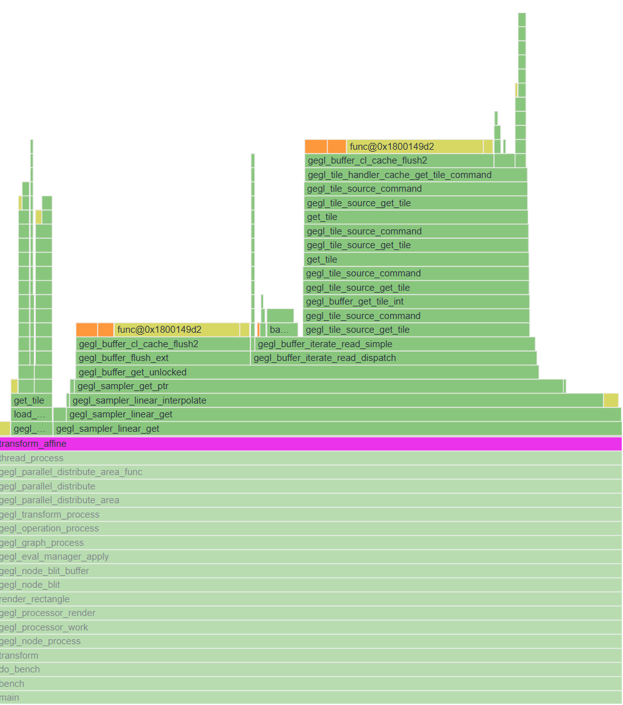

Members of the group:

- Christophe Künzli
- Léonard Jouve

[Our repository](https://github.com/LeonardJouve/gegl)

# Introduction

During this project, we are requested to analyze the performances of part of an open source project, and propose some
optimizations. We chose the [gegl](https://gegl.org/) project ([repo](https://gitlab.gnome.org/GNOME/gegl/)), which is
an image processing library used by GIMP. We focused on its transformation operations (see `operations/transform`),
and more precisely on the`gegl_operation_transform` operation, which is used to perform one or multiple affine
transformations on images, such as scaling, rotation, and shearing. We chose this operation because it is widely used in
image processing, and it is a good candidate for optimization, as it involves a lot of computations.

# Build project

Gegl uses meson to build the project and manage dependencies.

All listed dependencies can be found in root `meson.build` file.
Most of them can be installed via your platform package manager.

One of the dependencies is `babl` ([repo](https://gitlab.gnome.org/GNOME/babl)). It is another GNOME project used as a
pixel encoding and color space conversion engine.

It can be installed by following the `INSTALL.in` instructions.

Each dependency must include a `.pc` file in `PKG_CONFIG_PATH` to be found by meson.

```
meson setup buildDir
meson compile -C buildDir -j6
```

# Benchmark

We have written a simple benchmark that runs a transform operation 1000 times and computes average time spent on the
operation, along with min and max times.

<details>
  <summary>Click here to display benchmark code</summary>

```c++
void transform_for_benchmark(GeglBuffer *buffer) {
    GeglBuffer *buffer_sink;
    GeglNode *gegl, *source, *rotate, *sink;

    gegl = gegl_node_new();
    source = gegl_node_new_child (gegl, "operation", "gegl:buffer-source", "buffer", buffer, NULL);

    // transform operations
    rotate = gegl_node_new_child(gegl, "operation", "gegl:rotate", "degrees", 90.0, NULL);
    sink = gegl_node_new_child (gegl, "operation", "gegl:buffer-sink", "buffer", &buffer_sink, NULL);

    gegl_node_link_many(source, rotate, sink, NULL);
    gegl_node_process(sink);// process the sink node to execute the operations

    g_object_unref(gegl);
    g_object_unref(buffer_sink);
}

void benchmark() {
    GeglBuffer *buffer = test_buffer(1024, 512, babl_format("R'G'B' u8"));

    int iterations = 1000;
    int warmup = 10;
    double minTime = DBL_MAX, maxTime = 0.0, totalTime = 0.0;

    // warm-up
    for (int i = 0; i < warmup; ++i) {
        transform_for_benchmark(buffer);
    }

    // benchmark
    for (int i = 0; i < iterations; ++i) {
        struct timespec start, end;

        clock_gettime(CLOCK_MONOTONIC, &start);
        transform_for_benchmark(buffer);
        clock_gettime(CLOCK_MONOTONIC, &end);

        // Calculate time in seconds as a double
        double time = (end.tv_sec - start.tv_sec) + (end.tv_nsec - start.tv_nsec) / 1e9;

        totalTime += time;
        if (time < minTime) minTime = time;
        if (time > maxTime) maxTime = time;
    }

    double averageTime = totalTime / iterations;

    printf("Benchmark results (%d iterations):\n", iterations);
    printf("  Total Time:   %.6f s\n", totalTime);
    printf("  Min Time:     %.6f s\n", minTime);
    printf("  Max Time:     %.6f s\n", maxTime);
    printf("  Average Time: %.6f s\n", averageTime);

    g_object_unref(buffer);
}
```

</details>

How to run benchmark :

```
# Run all tests
meson test -C buildDir

# Run all benchmarks
meson test -C buildDir --benchmark

# Run only our benchmark :
meson test -C buildDir --benchmark 'Perf Test transform'     
```

**Important notes** :

- You can switch between the original implementation and our implementation by opening the `
  operations/transform/transform-core.c` file and commenting/uncommenting `#define TRANSFORM_HALIDE` and rebuilding the
  project. If `TRANSFORM_HALIDE` is defined, the benchmark will use our implementation, otherwise it will use the
  original implementation.
- Text sent to standard output during the benchmark will not be shown in the terminal when running the benchmark, as
  meson captures the output of benchmarks. To see the output, you can check the log file generated by meson, which is
  located in `buildDir/meson-logs/testlog.txt`.
- The benchmark can also be used to perform a predefined transformation on an actual image and save it to disk. To
  use this feature, you need to open the `perf/test-transform.c` file and set IMAGE_IN and IMAGE_OUT to the path of the
  input image and the output image respectively. Then, rebuild the project and run the benchmark as shown above. The
  output image will be saved to the specified path.

# Analysis

Our first step was to analyze the code of the `gegl_operation_transform` operation, and identify the parts that are
the most computationally expensive. We wrote a simple benchmark in order to measure the time of a simple image
transformation pipeline and also generated a flame graph to find any bottlenecks using VTune.

## Flame graph



As we can see, `transform_affine` takes almost 100% of the `main` function time. This is not surprising as we are only
doing an affine transformation. We also see there is a big over-head for a simple operation such as affine
transformation.

# Affine transformation

## Overview

Image transformations are fundamental operations in image processing and computer graphics. They modify the spatial
arrangement of pixels to achieve effects such as translation, rotation, scaling, and shearing.

Affine transformations form an important class of geometric transformations because they preserve straight lines and
parallelism. As a result, they can represent a wide range of practical image manipulations while remaining
computationally efficient.

## Transformation Matrices

Affine transformations are typically represented using matrices.
A transformation matrix encodes how the coordinates of a pixel should be modified when applying a transformation.

For example:

- translation matrix moves pixels horizontally and vertically
- scaling matrix enlarges or shrinks an image
- rotation matrix rotates pixels around a specified point
- shear matrix skews the image along one axis

One of the main advantages of matrix-based transformations is that multiple operations can be combined into a single
matrix.

For example, an image can be scaled, rotated, and translated by multiplying the corresponding matrices together and
applying the resulting matrix once.

## Forward Mapping

A straightforward way to transform an image is to iterate through all source pixels and compute where they should appear
in the destination image.

- Read a pixel from the source image
- Apply the transformation matrix to its coordinates
- Write the pixel to the resulting position in the destination image

This approach is called forward mapping.
While simple, forward mapping has a major drawback:
some destination pixels may never receive a value, creating visible holes or gaps in the transformed image.

## Inverse Mapping

To avoid gaps, most image processing libraries use inverse mapping.

For each pixel in the destination image:

- Apply the inverse transformation matrix
- Compute the corresponding position in the source image
- Read the source pixel value
- Write the value to the destination pixel

Using inverse mapping guarantees that every pixel in the output image is assigned a value.

## Advantages of Matrix-Based Transformations

Representing transformations as matrices offers several advantages:

- Multiple operations can be combined into a single matrix
- Well suited to optimization and parallelization

Consequently, matrix-based affine transformations are the standard technique used in modern image processing libraries
and graphics frameworks.

See this ressource :

- https://www.youtube.com/watch?v=E3Phj6J287o

# Proposed optimization

We will try to reduce the overhead of the operation by using a more efficient algorithm for affine transformation with
Halide. We only focus on affine transformations as a proof-of-concept but this could be generalized to all the
transformations in a future work.

## Halide

[Halide](https://halide-lang.org/) is a domain-specific language for image processing and computational photography. It
is designed to make it easier to write high-performance image processing code, and we will use to see if it performs
better than the current implementation of `gegl_operation_transform`.

**We used Halide version 21.0.0**

See : https://halide-lang.org/tutorials

## Implementation

see `operations/transform/halide.cpp` and `operations/transform/transform-core.c`.

Our implementation replaces the function `transform_affine`, we can switch between out implementation and our the
original implementation by defining or not `#define TRANSFORM_HALIDE` in `operations/transform/transform-core.c`.

`halide.cpp` is built as a standalone object file and header file. These object and header file are linked to the Gegl
library.

<details>
  <summary>Click here to display simplified halide code</summary>

```c++
ImageParam input(UInt(8), 3, "input");
ImageParam inverse_matrix(Float(32), 2, "matrix");
Param<int> roi_x{"roi_x"};
Param<int> roi_y{"roi_y"};

Var x, y, color;

Func transform;

Expr xf = cast<float>(x + roi_x) + 0.5f;
Expr yf = cast<float>(y + roi_y) + 0.5f;

Expr u =
    inverse_matrix(0, 0) * xf +
    inverse_matrix(1, 0) * yf +
    inverse_matrix(2, 0);
Expr v =
    inverse_matrix(0, 1) * xf +
    inverse_matrix(1, 1) * yf +
    inverse_matrix(2, 1);

Expr sx = clamp(cast<int>(floor(u)), 0, input.dim(1).extent() - 1);
Expr sy = clamp(cast<int>(floor(v)), 0, input.dim(2).extent() - 1);

transform(color,x, y) = input(color, sx, sy);
```

</details>

An important thing to note that our implementation does not properly support all transform operations. For example,
shearing and scaling are not supported in our version. Also, we only focused on RGB images format (no Alpha) and did not
test other formats, so our implementation may not work properly with other formats.

Due to time constraints, we were unable to identify the root cause of the bug. However, this project is not intended to
be a drop-in replacement for the current implementation. Instead, it serves as a proof of concept to evaluate whether
the idea is worth pursuing further.

## Comparison with current implementation

| Implementation | Time (s)  | average (s) | min (s)  | max (s)  |
|----------------|-----------|-------------|----------|----------|
| Original       | 20.351498 | 0.020351    | 0.014517 | 0.035250 |
| Halide         | 3.693380  | 0.003693    | 0.002921 | 0.006582 |

While this is a very simple benchmark, it shows that our implementation using Halide is significantly faster than the
original implementation. The average time is reduced by a factor of 5.5, and the min and max times are also
significantly reduced.

The results are a bit biased as our Halide solution is simplified compared to the existant one and does not act as a
full replacement but very encouraging.

## Further improvements and optimizations

- Implementing support for all transform operations, including shearing and scaling.
- Adding support for more image formats, including those with alpha channels.
- Optimizing the Halide implementation further by exploring scheduling strategies and parallelization techniques offered
  by Halide.

# Difficulties encountered

- Understanding and building the gegl project.
- Understanding affine transformations and how they are implemented in the current codebase.
- Learning how to use Halide and how to integrate it into the existing codebase.

# Conclusion

Benchmark results show a significant performance improvement compared to the current implementation. The Halide-based
version achieved an average execution time approximately 5.5 times lower than the original implementation, demonstrating
the potential benefits of using a DSL designed for image processing.

However, the current implementation should not be considered a drop-in replacement for the existing GEGL transform
operation. Several features supported by the original implementation are not yet implemented, and the benchmark was
performed on a simplified workload. Consequently, the results should be interpreted as an indication of the potential
performance gains rather than a direct comparison between two feature-equivalent implementations.

Despite these limitations, the project successfully demonstrates the feasibility of integrating Halide into GEGL for
affine image transformations. Future work could focus on supporting the complete set of transformation operations,
improving compatibility with existing image formats, and exploring additional optimization opportunities through
Halide's scheduling and parallelization capabilities.

Overall, the results are encouraging and suggest that further investigation of a Halide-based implementation is
justified.
